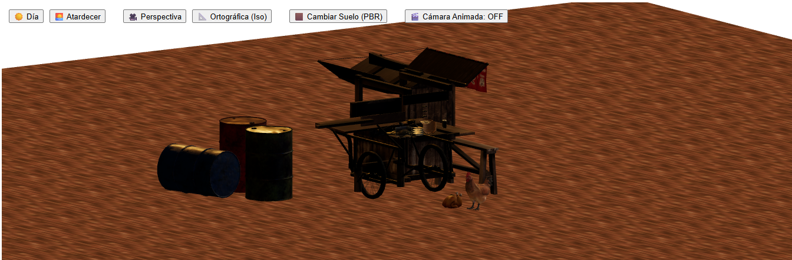
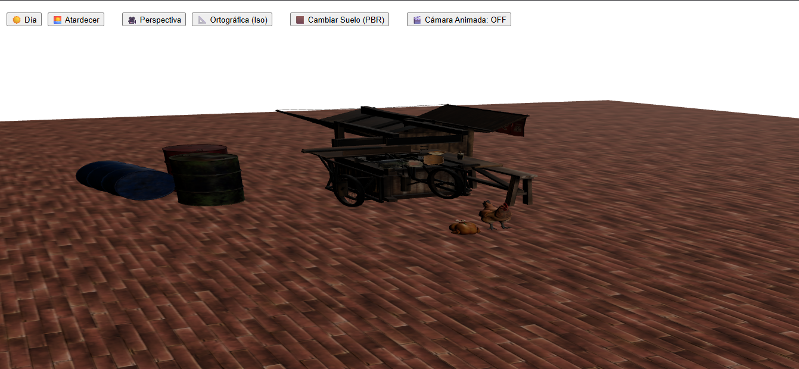
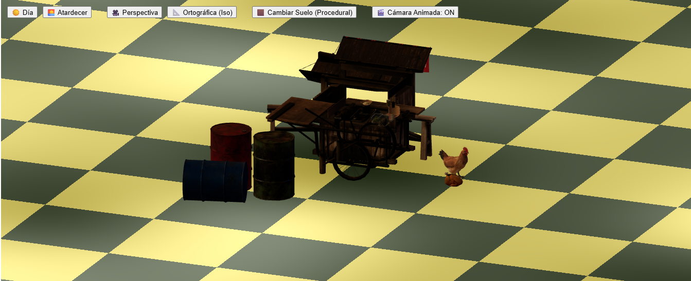

# 🌐 Mundo 3D en React Three Fiber

## 📖 Concepto general
El proyecto crea un **mundo virtual interactivo** que combina modelos 3D importados en formato GLB, suelos con **texturas PBR realistas** y un **shader procedural** que mezcla patrones de damero y ruido. La escena se basa en un paisaje un poco particular ya que integra una gallina, un kiosco de venta de ramen y unos barriles de metal. Este busca ser un espacio experimental para explorar iluminación, materiales, texturas, distintos tipos de cámara y animaciones en tiempo real.

---

## 🏗️ Modelos GLB utilizados
- **miModelo.glb**
  - Descripción: Una gallina cocinada y una sin cocinar
  - Fuente: archivo local `/modelos/miModelo.glb`
  - Modificaciones: escalado a `2.5`, animado con rotación continua.
- **ramen-yatai.glb**
  - Descripción: Puesto de comida móvil de comida Japonesa 
  - Fuente: archivo local `/modelos/ramen-yatai.glb`
  - Modificaciones: escalado a `0.5`, posición en el centro de la escena.
- **oil_drums.glb**
  - Descripción: 3 barriles metálicos de aceite
  - Fuente: archivo local `/modelos/oil_drums.glb`
  - Modificaciones: escalado a `2`, ubicado en `[3, 0, -4]`.

---

## 💡 Iluminación
La escena combina diferentes esquemas de luz para dar profundidad y atmósfera:

- **Key Light**: `directionalLight` principal, con sombras activas.
- **Fill Light**: segunda `directionalLight` de menor intensidad para rellenar sombras.
- **Rim Light (opcional)**: se simula con un ángulo lateral en el preset “sunset”.
- **Ambient Light**: controla el nivel general de iluminación suave.
- **Presets disponibles**:
  - ☀️ **Día**: luz blanca intensa, tonos fríos de relleno.
  - 🌅 **Atardecer**: luz cálida anaranjada con relleno azul, ambiente más dramático.
- **Luz animada**: una `directionalLight` que orbita como si fuera el sol, cambiando el ángulo de incidencia a lo largo del tiempo.

---

## 🎨 Materiales y Texturas (PBR)
- **Suelo PBR**:
  - Mapas: `basecolor`, `normal`, `roughness`, `displacement`.
  - Parámetros principales:
    - `roughness = 0.9` → superficie mate, menos reflejante.
    - `metalness = 0.1` → baja metalicidad, simula madera.
    - `displacementScale = 0.1` → relieve físico.
  - Justificación: se buscó simular un suelo de ladrillo con detalles realistas, muy similar al suelo de una plaza o parque donde se podrían encontrar estos objetos en la vida real.

---

## 🧩 Shaders procedurales
- **Shader aplicado al suelo alternativo**:
  - **Patrón damero** → controlado por `cellSize` (tamaño de celdas).
  - **Ruido simple** → controlado por `noiseScale` (detalle) e `intensity` (mezcla).
  - **Parámetros principales**:
    - `cellSize = 12.0` → tamaño de las celdas.
    - `noiseScale = 6.0` → escala del ruido.
    - `intensity = 0.4` → proporción damero/ruido.
    - Colores: beige (`#f0e68c`) y verde oscuro (`#556b2f`).
    - `roughness = 0.9`, `metalness = 0.2`.
  - Resultado: suelo procedimental que mezcla geometría simple con variación orgánica para resaltar bien la diferencia con el suelo de ladrillo.

---

## 📷 Cámaras
- **Perspectiva (PerspectiveCamera)**:
  - Usada para simular visión humana.
  - Ideal para destacar profundidad y escala de los objetos.
- **Ortográfica (OrthographicCamera)**:
  - Usada para vistas tipo isométrica.
  - Intención: mostrar proporciones exactas sin distorsión de perspectiva.
- **Alternancia**:
  - Controlada por botones en la interfaz.
  - El usuario decide qué modo utilizar según el enfoque de observación.

---

## 🎬 Animaciones
- **Cámara animada**:
  - Recorre un círculo alrededor de la escena (`radius = 8`), mirando siempre al centro.
  - Puede activarse o desactivarse desde la interfaz.
- **Luz animada**:
  - `directionalLight` que orbita lentamente, simulando el movimiento del sol.
- **Objeto animado**:
  - El modelo de la gallina rota continuamente sobre su eje `Y`.

---

## 🕹️ Interactividad
- Botones en la UI permiten:
  - Cambiar entre **Día / Atardecer**.
  - Alternar el tipo de cámara **Perspectiva / Ortográfica**.
  - Alternar entre **Suelo PBR / Procedural**.
  - Activar/desactivar la **cámara animada**.

## Caputuras de pantalla

## GIFs animados

