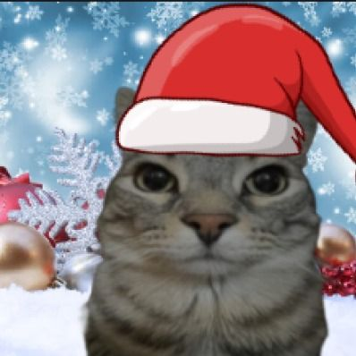

## Punto 1 - Python

## Punto 1 – Procesamiento de Imágenes en Python

Se realizó un procesamiento básico de la imagen `gato.jpg` usando Python y OpenCV. Primero, se cargó la imagen en RGB y se visualizó la original para observar sus colores y detalles. Posteriormente, se aplicaron filtros de **desenfoque** y **realce de bordes**, notando que el desenfoque suaviza la imagen y difumina detalles finos, mientras que el realce de bordes resalta los contornos y las formas principales.

Además, se separaron los **canales R, G y B**, lo que permitió analizar cómo cada canal resalta diferentes estructuras de la imagen: el canal rojo destaca zonas cálidas, el verde resalta vegetación y el azul enfatiza sombras y detalles oscuros. También se aplicaron **operaciones morfológicas** (erosión y dilatación) sobre la versión binarizada, mostrando cómo estas operaciones adelgazan o engrosan las regiones blancas de la imagen.

Imágen original:

Finalmente, se generó un **GIF animado** que recorre la imagen original, los resultados de los filtros y las operaciones morfológicas de manera secuencial, con 1 segundo por frame y repetición en bucle. Este GIF permite visualizar fácilmente los efectos de cada procesamiento y comprender cómo los diferentes filtros y transformaciones alteran la imagen.

GIF con los resultados:

--- 

##  Punto 2 – Three.js

###  Demostración

### Implementación de Requisitos

#### Cambio de Perspectiva (Cámaras)

Se configuraron dos objetos `THREE.PerspectiveCamera`: `camera1` (vista principal) y `camera2` (vista lateral/elevada).

* La variable `currentCamera` almacena la cámara activa.
* Un **`eventListener`** escucha la pulsación de la tecla **`P`**.
* Al pulsar `P`, `currentCamera` se alterna entre `camera1` y `camera2`.
* Después de cambiar la cámara, se actualiza el objeto **`controls.object`** de `OrbitControls` para que los controles interactúen con la nueva perspectiva.

#### Animaciones

Se utiliza la función `requestAnimationFrame(animate)` para crear un **bucle de render continuo**.

* Se inicializa un `THREE.Clock` para obtener el tiempo transcurrido (`elapsedTime`), lo que asegura animaciones basadas en el tiempo y no en la velocidad de fotogramas.
* **Cubo (Box):** Su rotación en los ejes X e Y se actualiza continuamente usando `cube.rotation.y = elapsedTime * 0.5;`.
* **Esfera (Sphere):** Su posición vertical (`Y`) oscila utilizando la función seno: `sphere.position.y = 1.5 + Math.sin(elapsedTime * 2) * 0.5;`, creando un efecto de rebote.

#### Texturas e Iluminación

Se usó un `THREE.TextureLoader` para cargar las imágenes de las texturas.

* **Textura 1 (Suelo de nieve):** Aplicada al `THREE.PlaneGeometry` (el suelo) con `THREE.MeshPhongMaterial({ map: groundTexture })`.
* **Textura 2 (Envoltura de regalo de navidad):** Aplicada al `THREE.BoxGeometry` (el cubo) con `THREE.MeshStandardMaterial({ map: boxTexture })`.

**Iluminación:**

1.  **Luz Direccional (`DirectionalLight`):** Simula una fuente de luz lejana (como el sol), proyectando sombras definidas.
2.  **Luz Ambiental (`AmbientLight`):** Una luz general suave para asegurar que todas las caras de los objetos sean visibles.

#### OrbitControls

Se importa la librería `OrbitControls.js` y se inicializa con la cámara actual y el `renderer.domElement`.

* **Implementación:** `const controls = new THREE.OrbitControls(currentCamera, renderer.domElement);`
* Para un movimiento más suave, se activó `controls.enableDamping = true;` y `controls.dampingFactor = 0.05`.
* Se llama a **`controls.update()`** dentro del bucle de animación (`animate()`) para procesar la interacción del usuario (rotación, zoom/scroll, pan/click derecho).

---
